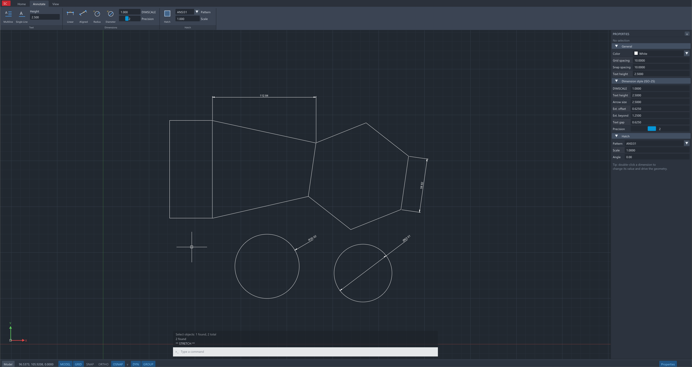

# StarCAD

A simple 2D drafting app built with Dear ImGui. Runs on desktop and in the browser.



## Build (desktop)

```
meson setup buildDir
meson compile -C buildDir
```

Run `buildDir/starcad`.

## Build (web)

Requires the Emscripten SDK on your PATH.

```
meson setup buildWeb --cross-file web/emscripten.ini
meson compile -C buildWeb
python -m http.server -d buildWeb
```

Open `http://localhost:8000/starcad.html`.

## Usage

Type commands (e.g. `L`, `C`, `REC`, `TR`, `DLI`) and press Enter or Space. Esc cancels.

| Command | Aliases | Description |
|---|---|---|
| LINE | L | Creates straight line segments |
| PLINE | PL | Creates a 2D polyline |
| CIRCLE | C | Creates a circle |
| ARC | A | Creates an arc |
| RECTANG | REC, RECTANGLE | Creates a rectangular polyline |
| POLYGON | POL | Creates an equilateral closed polyline |
| ELLIPSE | EL | Creates an ellipse |
| HATCH | H, BH, BHATCH | Fills an enclosed area with a hatch pattern |
| TEXT | DT, DTEXT | Creates single-line text |
| MTEXT | T, MT | Creates multiline text |
| ERASE | E | Removes objects from a drawing |
| MOVE | M | Moves objects |
| COPY | CO, CP | Copies objects |
| ROTATE | RO | Rotates objects around a base point |
| SCALE | SC | Enlarges or reduces objects |
| MIRROR | MI | Creates a mirrored copy of objects |
| TRIM | TR | Trims objects to meet the edges of other objects |
| EXTEND | EX | Extends objects to meet the edges of other objects |
| JOIN | J | Joins objects to form a single object |
| EXPLODE | X | Breaks a polyline into its component objects |
| GROUP | G | Creates a group of objects |
| UNGROUP | UNG | Disassociates the objects in a group |
| DIMLINEAR | DLI | Creates a linear dimension |
| DIMALIGNED | DAL | Creates an aligned dimension |
| DIMRADIUS | DRA | Creates a radius dimension |
| DIMDIAMETER | DDI | Creates a diameter dimension |
| ZOOM | Z | Zooms the view |
| U | UNDO | Reverses the most recent operation |
| REDO | | Reverses the effects of the previous UNDO |
| PROPERTIES | PR, CH, MO, PROPS | Shows the Properties palette |
| OSNAP | OS, DSETTINGS, DS, SE | Sets object snap modes |
| GRID | | Displays a grid pattern |
| SNAP | SN | Restricts cursor movement to intervals |
| SCRIPT | SCR | Executes a sequence of commands from a script file |

## To-Do

- [x] Drawing: line, polyline, circle, arc, rectangle, polygon, ellipse
- [x] Hatch (SOLID, ANSI31, ANSI37) with pick-point boundary detection and islands
- [x] Single-line and multiline text
- [x] Object snaps (endpoint, midpoint, center, quadrant, intersection, perpendicular, insertion, nearest)
- [x] Grouping and ungrouping
- [x] Join, trim and extend
- [x] Move, copy, rotate, mirror, scale, erase, explode
- [x] Grip editing (stretch, move, rotate, scale, mirror)
- [x] Linear, aligned, radius and diameter dimensions
- [x] Associative dimensions that follow and drive (stretch or scale) their geometry
- [x] Command line, aliases, keyboard shortcuts and typed coordinates
- [x] Dynamic input, ortho, grid and snap
- [x] Undo / redo
- [x] Properties palette
- [x] Dark UI (ribbon, status bar, crosshair)
- [x] Script (.scr) support
- [x] Web build (WebAssembly + WebGL 2)
- [ ] Save / open drawings (DXF)
- [ ] Layers
- [ ] OFFSET
- [ ] FILLET / CHAMFER
- [ ] Arc segments in PLINE
- [ ] Trimming and extending ellipses
- [ ] Angular dimensions
- [ ] Polar tracking and object snap tracking
- [ ] Mid-point and similar snapping
- [ ] Copy / paste (Ctrl+C / Ctrl+V)
- [ ] Linetypes and lineweights
- [ ] Paper space / layouts and printing
- [ ] Proportional font for the web build
